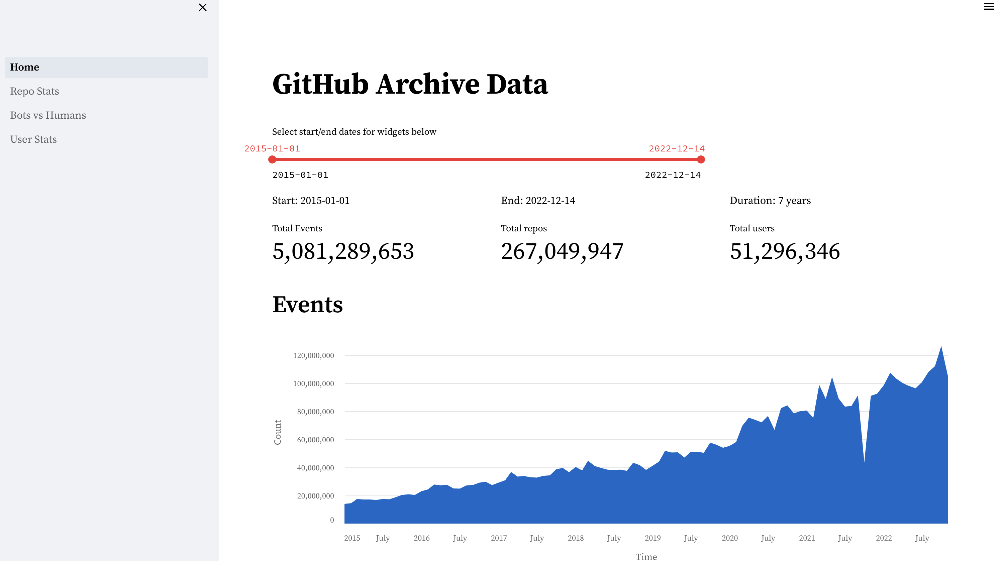
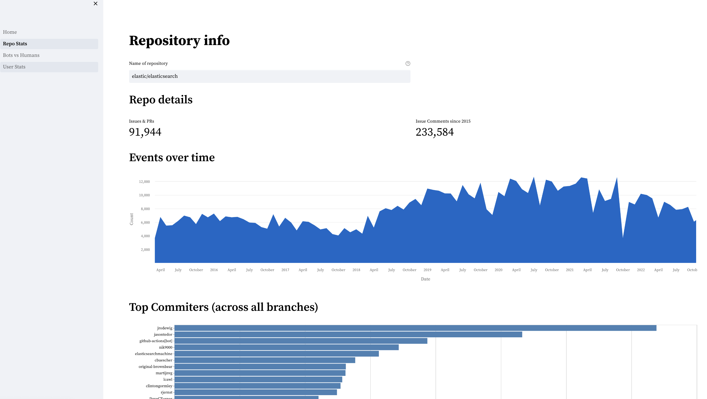
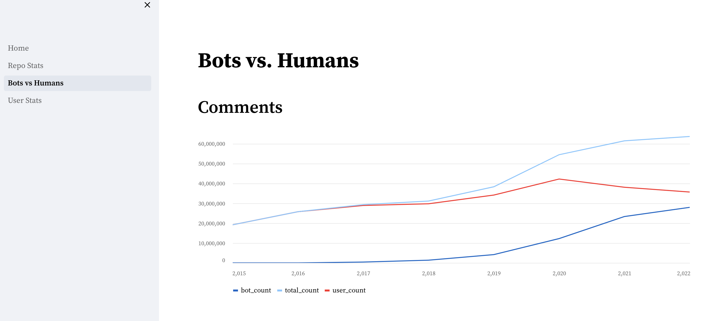
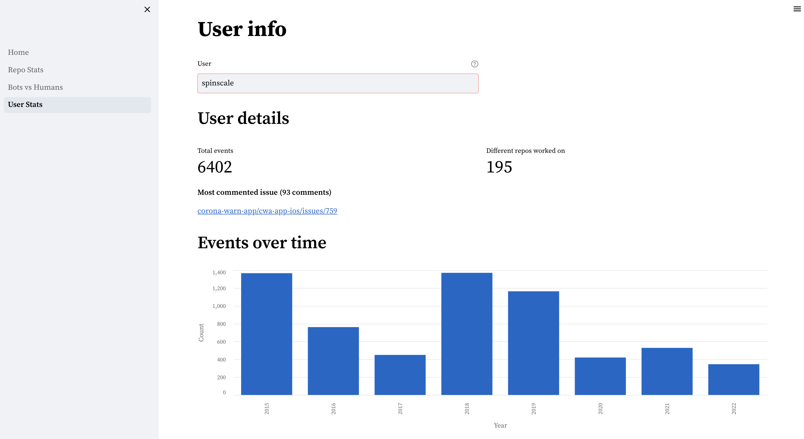

# Streamlit Demo using GitHubArchive Data

This is a streamlit demo using the [GitHub archive
data](https://www.gharchive.org/) indexed into Firebolt.









You need to configure four environment variables in  your environment (or just
put them into an `.env` file as `pipenv` reads that one automatically.

```
FIREBOLT_ENGINE=
FIREBOLT_DATABASE=
FIREBOLT_USER=
FIREBOLT_PASSWORD=
```

Once this is configured, you need to install the dependencies once using pipenv

```bash
pipenv install
```

In order to start the streamlit app, go with 

```bash
pipenv run streamlit run main.py
```

If you need to do changes to any of the files, they will be picked up
automatically.

